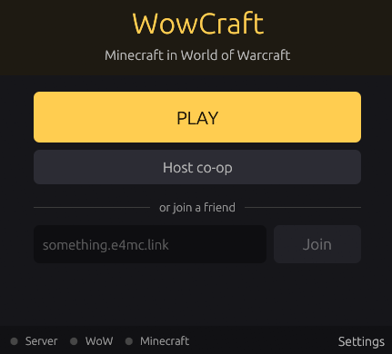

# WowCraft

Minecraft inside World of Warcraft 1.12. Runs on your PC with its own WoW server. Co-op with friends.

<p align="center">
  <a href="https://youtu.be/sX3lsLiPS2s">
    
  </a>
  <br>
  <sub>▶ Watch on YouTube</sub>
</p>

<p align="center">
  
</p>

> **Disclaimer.** WowCraft does **not** include or distribute World of Warcraft, its client, or
> any Blizzard game files, and it does not include Minecraft. You need your own WoW 1.12.1
> client and your own Minecraft Java Edition account. The server's map data is extracted on
> your PC from your client the first time you play.
>
> Fan project. Not affiliated with Blizzard Entertainment, Mojang Studios or Microsoft.
> World of Warcraft is a trademark of Blizzard Entertainment; Minecraft is a trademark of Mojang Studios.

> **Early test build.** Expect bugs and things that don't work yet. Back up your WowCraft folder if you care about your saves.

## Requirements

| | |
|---|---|
| WoW client | 1.12.1 client folder (with `WoW.exe` and `Data`) |
| Minecraft | Java Edition, your own Microsoft account |
| OS | Windows 10 or 11, 64-bit |
| Disk | ~4 GB free |

## Install

1. Download `WowCraft.zip` from [Releases](../../releases/latest).
2. Unzip anywhere (not inside `Program Files`).
3. Run `WowCraft.exe`.
4. Settings → Browse → pick your WoW 1.12 folder.
5. Press **PLAY**.

## First start

1. Maps are extracted from your WoW client (~10–15 min, once).
2. Prism Launcher opens: sign in with your Microsoft account. It downloads Minecraft and Java (once).
3. WoW opens, waits for Minecraft, then logs in by itself. Make a character, Enter World.

Pathfinding builds in the background for about an hour; you can play meanwhile.

## Keybinds

**Minecraft**

| Key | Action |
|---|---|
| `Space` | Jump / get off a boat, zeppelin or tram |
| `E` | Inventory |
| `T` | Minecraft chat |
| `Esc` | Minecraft menu |

**WoW**

| Key | Action |
|---|---|
| `C` | WoW cursor on/off (NPCs, loot, quests) |
| `Enter` | WoW chat |
| `M` | Map |
| `L` | Quest log |
| `B` | Bags |
| `O` | WoW menu |

## Commands

Type these in WoW chat (`Enter`). Use WoW character names.

| Command | What it does |
|---|---|
| `.goname Name` | Teleport to a player (their WoW character name) |
| `.namego Name` | Teleport a player to you (their WoW character name) |
| `.levelup 10` | Gain 10 levels. To level a friend, first `/target Name` (their WoW character name) |
| `.tele Orgrimmar` | Go to a place |
| `.lookup tele storm` | Find place names for `.tele` |
| `.go xyz X Y Z map` | Go to exact coordinates |
| `.gps` | Show your coordinates |
| `.gm on` / `.gm off` | Creatures ignore you |

In Minecraft chat (`T`): `/gamemode creative`, `/gamemode survival`.

## Co-op

| | |
|---|---|
| Host | Press **Host co-op**, then **Copy** the link that appears and send it. |
| Join | Paste a friend's link, press **Join**. Your WoW account is made for you. |

Everyone needs their own install, WoW client and Minecraft account.

## Saving

**Stop** (or closing the launcher) closes WoW, Minecraft and the server, saving everything.
Saves live in the WowCraft folder (`mariadb\data` and Prism's `WowCraft` instance).

## Updating

The launcher checks for new versions on start. When one is out, press **Update**. Saves and
settings are kept.

Manually: unzip a newer `WowCraft.zip` over your WowCraft folder. Same result.

## Troubleshooting

| Problem | Fix |
|---|---|
| WoW 1.12 not found | Pick the folder that has `WoW.exe` and `Data` in it. |
| First setup failed | Check `server\data\*.log`, press PLAY again. |
| Minecraft doesn't start | Sign in to Prism (Accounts, top right), press PLAY again. |
| Stuck on "Please wait" | Minecraft is still loading. When joining: check the link. |
| Port in use | Close any other WoW server or database. |

Logs: `wow\run_err.txt` (WoW), `server\logs` (server), Prism's instance log (Minecraft).

## Known issues

- Boats, trams and zeppelins may work weird.

## What's included

Licences are in the download's `licenses` folder.

- **Benilla** — WoW client (`wow\benilla.exe`), MIT or Apache-2.0, with WowCraft's changes
- **[vmangos](https://github.com/vmangos/core)** — WoW server (`server\`), GPL-2.0
- **[MariaDB](https://github.com/MariaDB/server)** — database (`mariadb\`), GPL-2.0
- **[Prism Launcher](https://github.com/PrismLauncher/PrismLauncher)** — Minecraft launcher (`prism\`), GPL-3.0
- **[Fabric API](https://github.com/FabricMC/fabric)** — Apache-2.0
- **[e4mc](https://github.com/vgskye/e4mc-minecraft-architectury)** — co-op links, MIT
- **[Lithium](https://github.com/CaffeineMC/lithium)**, **[FerriteCore](https://github.com/malte0811/FerriteCore)** — performance, LGPL-3.0 / MIT
- **WowCraft mod** and **launcher** — MIT
- Microsoft Visual C++ runtime DLLs

No Blizzard or Mojang files are included.

## Building the launcher

```
cd launcher
cargo build --release
```

## License

Launcher source: [MIT](LICENSE).
